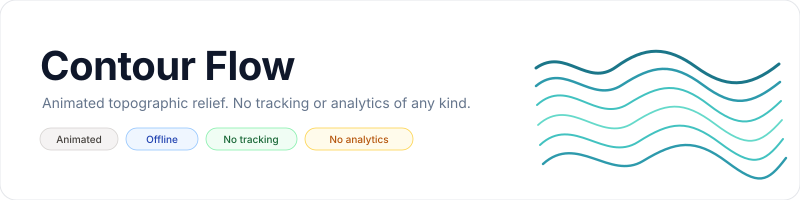
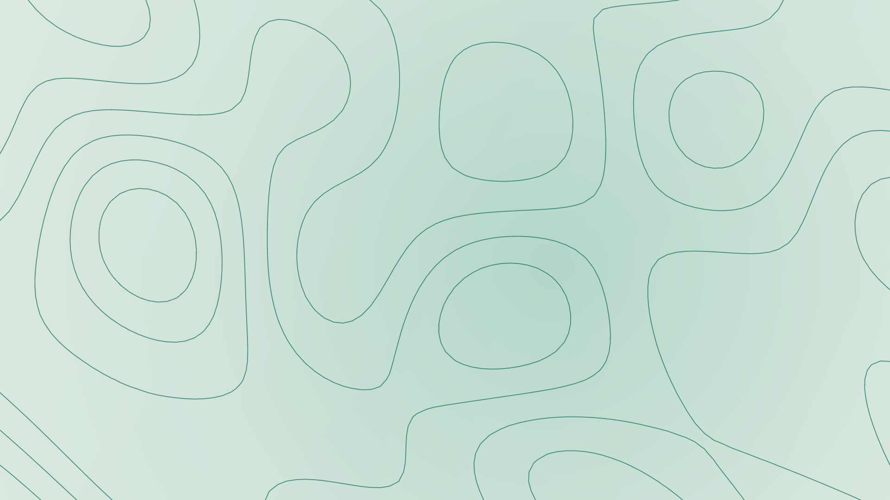
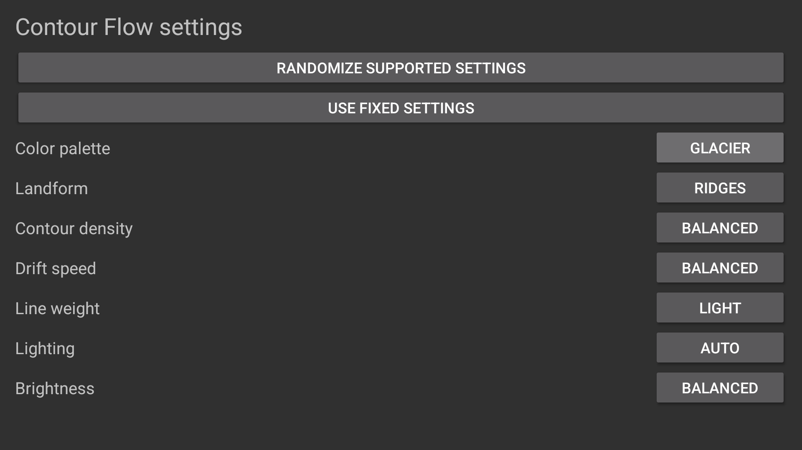

<p align="center">
  <picture>
    <source media="(prefers-color-scheme: dark)" srcset="art/banner-dark.svg">
    <source media="(prefers-color-scheme: light)" srcset="art/banner-light.svg">
    
  </picture>
</p>

<p align="center">Animated topographic contour lines for Fire TV, Android TV, and Google TV.</p>

<p align="center">
  <a href="https://github.com/jeremykenedy/contour-flow/releases"></a>
  <a href="https://github.com/jeremykenedy/contour-flow/releases"></a>
  <a href="LICENSE"></a>
  <a href="https://github.com/jeremykenedy/contour-flow/stargazers"></a>
  <a href="https://github.com/jeremykenedy"></a>
  <a href="https://github.com/sponsors/jeremykenedy"></a>
</p>

## Table of Contents

- [Overview](#overview)
- [Screenshots](#screenshots)
- [Features and settings](#features-and-settings)
- [Requirements](#requirements)
- [Install and activate](#install-and-activate)
- [Fire TV Toolkit](#fire-tv-toolkit)
- [Privacy](#privacy)
- [Device support](#device-support)
- [Build and tests](#build-and-tests)
- [Documentation](#documentation)
- [Credits](#credits)
- [License](#license)

## Overview

Contour Flow is an original Android DreamService that animates layered topographic lines over gently moving terrain fields. Its softly shifting relief creates a living map-like scene without labels, borders, or symbols.

Show some love by starring this repository on GitHub.

## Screenshots

Captured from the running Contour Flow preview on a Google TV API 34 emulator at 1920 x 1080, after a 45-second settling period. The scene uses Glacier palette and Day lighting. The second image shows the remote-operated settings screen.

<p align="center">
  <a href="docs/screenshots/contour-flow-google-tv-api34-1920x1080.png"></a>
</p>

<p align="center">
  <a href="docs/screenshots/contour-flow-settings-google-tv-api34-1920x1080.png"></a>
</p>

## Features and settings

- Continuously animated contour fields with three relief shapes: ridges, basins, and coast.
- Four palettes: Abyss, Slate, Sandstone, and Glacier.
- Adjustable contour density, drift speed, line weight, lighting, and brightness.
- Set each supported option to Random, or randomize all options when a session starts.
- Remote-friendly settings and a versioned app-owned settings provider.
- Canvas rendering at the display size supplied by Android. The app does not force a 4K surface.

## Requirements

- Android 6.0 (API 23) or newer.
- A TV device that supports Android DreamService screensavers.
- Android SDK platform 36, build-tools 36.0.0, Java, and ADB for local builds and installation.

## Install and activate

Download `contour-flow.apk` and `contour-flow.apk.sha256` from the [latest release](https://github.com/jeremykenedy/contour-flow/releases/latest). Connect ADB to the TV, then run the installer:

```bash
adb connect TV_IP:5555
python3 install.py --device TV_IP:5555 --apk ~/Downloads/contour-flow.apk
```

The installer checks the APK checksum, records the previous screensaver selection and enabled state, shows the planned changes, and asks before applying them. To restore the previous selection:

```bash
python3 install.py --device TV_IP:5555 --restore
```

To restore and uninstall Contour Flow:

```bash
python3 install.py --device TV_IP:5555 --uninstall
```

You can also install the APK with the TV's package installer, preview it from the app list, and select Contour Flow in the device's screensaver settings. Menu names vary by device. The standalone installer does not change sleep timers or claim to prevent vendor software from changing system settings.

## Fire TV Toolkit

[Fire TV Toolkit](https://github.com/jeremykenedy/fire-tv-toolkit) offers a guided terminal installer for catalogued screensavers and tools for managing screensaver selection, timers, and supported device safeguards. Install it from a fresh checkout:

```bash
git clone https://github.com/jeremykenedy/fire-tv-toolkit.git
cd fire-tv-toolkit
node setup.js
```

After Contour Flow is added to the Toolkit catalog, install it and select it with:

```bash
firetv-screensavers --install=contour-flow --yes
screensaver --set=contour-flow
```

Remove it with `firetv-screensavers --uninstall=contour-flow --force --yes`. To update Toolkit commands, run `git pull` and `node setup.js`, then install the new saver release using the install command above. Toolkit safeguards only cover settings the connected Fire TV supports. Fire TV UI can select installed DreamServices and display a preview, but it does not install arbitrary GitHub APKs.

## Privacy

Contour Flow requests no Internet permission and makes no runtime network requests. It has no ads, analytics, telemetry, crash reporting, tracking, or remote update checks. All scene animation is rendered locally. See [Privacy](docs/PRIVACY.md).

## Device support

| Device | Status | Notes |
|---|---|---|
| Google TV emulator, API 34, 1920 x 1080 | Preview tested | Installed the signed APK, opened its full-screen preview, tested remote palette selection, and inspected the settled scene capture. |
| Fire TV hardware | Untested | Looking for a Fire TV owner to test selection, idle startup, remote settings, and exit behavior. Please report the model, Fire OS/API, resolution, tested behavior, and results in [Issues](https://github.com/jeremykenedy/contour-flow/issues). |
| Android TV hardware | Untested | Looking for an Android TV owner to test device behavior and report the model, OS/API, resolution, tested behavior, and results in [Issues](https://github.com/jeremykenedy/contour-flow/issues). |
| Google TV hardware | Untested | Looking for a Google TV owner to test device behavior and report the model, OS/API, resolution, tested behavior, and results in [Issues](https://github.com/jeremykenedy/contour-flow/issues). |
| Native 4K output and sustained thermal behavior | Untested | Requires a physical 4K TV. The app renders at the size Android supplies and makes no native 4K performance claim. |

## Build and tests

```bash
./test.sh
./build.sh --unsigned
./build.sh
```

The signed build creates a unique local signing key under `~/.android/`. Keep its key and password backed up securely. They are ignored by Git and required to sign compatible updates.

## Documentation

- [Architecture](docs/ARCHITECTURE.md)
- [Artwork and screenshot provenance](docs/ARTWORK.md)
- [Building](docs/BUILDING.md)
- [Configuration](docs/CONFIGURATION.md)
- [Installation](docs/INSTALLATION.md)
- [Privacy](docs/PRIVACY.md)
- [Release process](docs/RELEASING.md)
- [Settings provider](docs/SETTINGS_PROVIDER.md)
- [Troubleshooting](docs/TROUBLESHOOTING.md)
- [Verification and device matrix](docs/VERIFICATION.md)

## Credits

The contour field, renderer, and visual assets are original to this repository. No third-party artwork, media, fonts, or runtime libraries are included.

## License

Contour Flow is licensed under the [Apache License, Version 2.0](LICENSE). See [NOTICE](NOTICE) for project notices.
